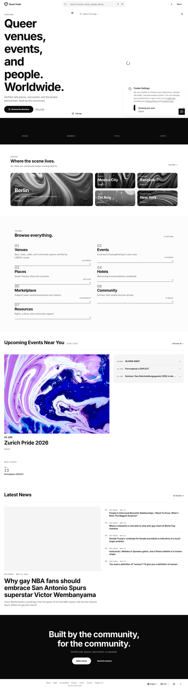

# Tobias Simon Mäder

**Digital product builder · marketing × code × community · Zürich · they/them** 🏳️‍🌈

> I build AI-powered search and community platforms for queer life — and tools that hold bad actors to account. Marketing brain, builder's hands, shipped solo.

🏳️‍🌈 Queer human-rights activist — group lead at **Queeramnesty Schweiz** (Amnesty International) since 2007.

💬 Open to interesting projects & collaborations

🛠 TypeScript · Python · React · Cloudflare Workers · Postgres / pgvector · Meilisearch

---

## Selected work

### 🌈 queer.guide &nbsp;·&nbsp; [Live ↗](https://queer.guide) &nbsp;·&nbsp; [Code ↗](https://github.com/tmaeder/queer-guide-hub)

A community platform for LGBTQ+ events, news, and travel — with personalized hybrid search over verified safe spaces worldwide.

`Workers AI` · `Vectorize` · `pgvector` · `Meilisearch` · `React`

### 📨 Sashay 404 &nbsp;·&nbsp; [Code ↗](https://github.com/tmaeder/operator-notify)

Weaponized politeness. Finds a site's providers (hosting, CDN, payment, social) and drafts legally-clean reports — deep-scan plus AI drafts behind a policy gate. Fairness and right-of-reply first, never threats.

`Cloudflare Workers` · `AI` · `web scraping`

### 🔎 Structured social search &nbsp;·&nbsp; [Code ↗](https://github.com/tmaeder/fetlife-search)

A Manifest V3 Chrome extension that turns free-text search on a high-volume social platform into structured, filterable discovery — client-side filters, saved searches, no history written.

`Manifest V3` · `Chrome extension` · `client-side search`

---

## What I do

| | |
|---|---|
| **Build** | TypeScript, Python, React, Cloudflare Workers, Postgres / pgvector |
| **Search / AI** | Hybrid search, embeddings, vector DBs, Workers AI, Meilisearch |
| **Marketing / Growth** | Digital marketing, content & campaigns, CMS, social, analytics |
| **People** | Community building, fundraising, comms, group leadership |

## Beyond code

Digital Marketing Manager by day. Queer activist for ~two decades — group lead at Queeramnesty Schweiz, working on human rights around sexual orientation and gender identity within Amnesty International.

## Contact

📫 [tmaeder@me.com](mailto:tmaeder@me.com) &nbsp;·&nbsp; [LinkedIn](https://www.linkedin.com/in/tobias-simon-m%C3%A4der-04407323/) &nbsp;·&nbsp; 🌍 Zürich, Switzerland

---

